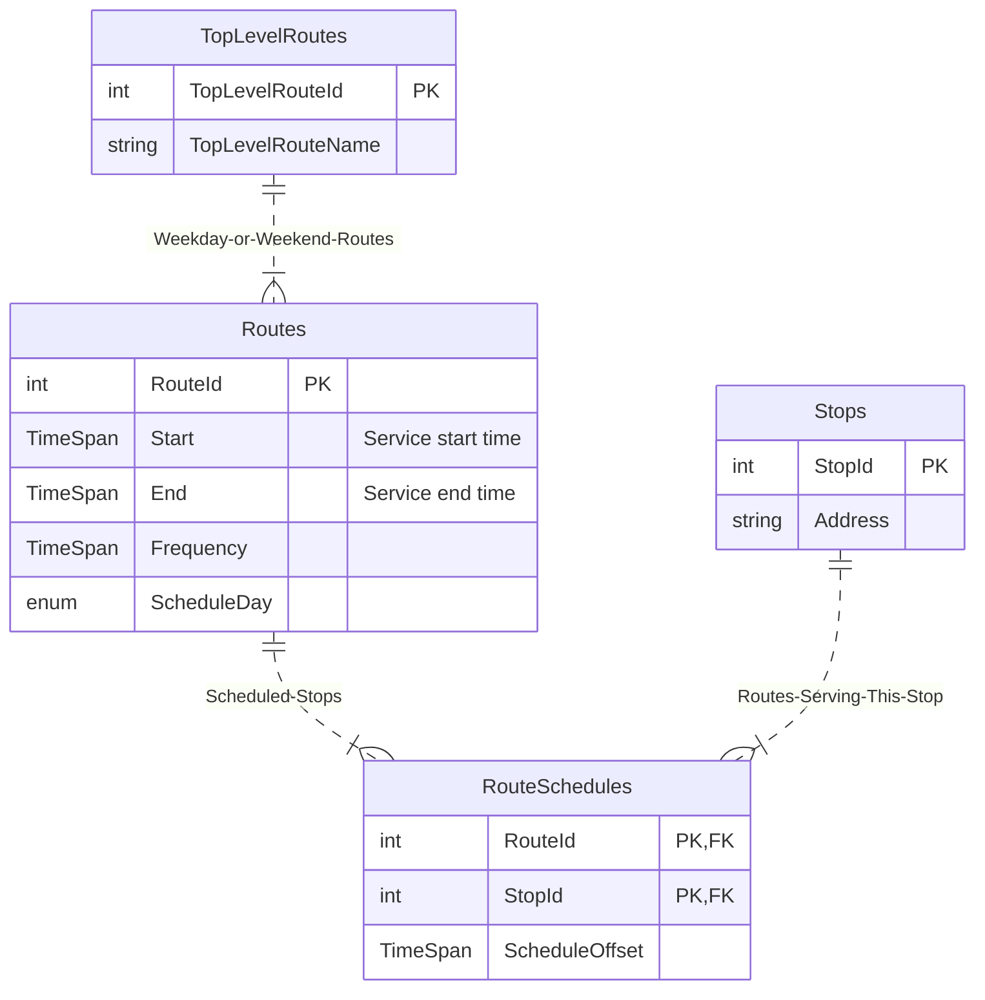

# Bus Schedule Demo
https://github.com/user-attachments/assets/14a53ee7-693e-4963-a2d9-55754eb4df78

## Layout
```
src
+---schedule-api
|   +---Controllers
|   +---Entities
|   +---Migrations
|   +---Models
|   +---Services
|   +---Utilities
|   +---wwwroot
|       +---scripts
+---schedule-api-unit-tests
```
- `schedule-api` is the main project folder .The layout follows established conventions - there's a single controller handling `transitInfo` API endpoints in the `Controllers` folder. `Entities` describe the underlying dataset, and `Migrations` apply the schema to the database. `Models` model the output data, `Services` and `Utilities` provide services and utilities to the app. Static assets (html, css, client side JavaScript) are served from `wwwroot`.
- `schedule-api-unit-tests` contains unit tests from utilities to API endpoints.
- The dataset is a SQLLite dataset which gets built at first run by applying a migration. The unit tests depend on this same dataset.

## Schema


## Build
 - Build `next-scheduled-bus.sln`

## Run
 - `F5` (or green play button) in Visual Studio
 - Navigate to `http://localhost:5103/`
 - To run tests, open Test Explorer in VS and run all tests (or just `Tests > Run All Tests`)
